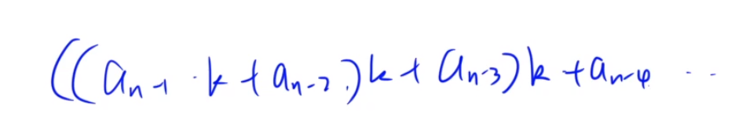
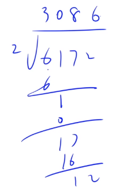
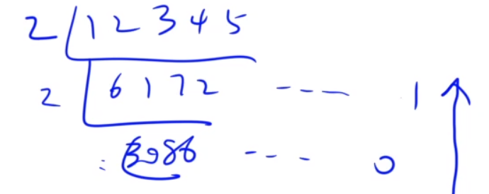
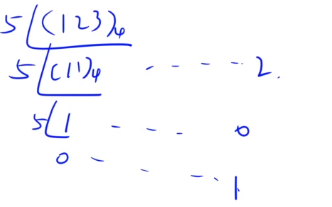

### 1、排序和进位制

稳定排序`stable_sort(start, end)`

​	类比`sort(start, end, greater<类型>())`从大到小进行排序，maybe要重载大于号>的运算符

​	`stable_sort(start, end, greater<类型>())`也是稳定的从到到小进行排序


运算符重载

```c++
bool operate< (const 类名& 对象名) const{
    return 对象名.属性 < 对象名.属性;
}
```


其它进制转换**十进制**

​	利用秦九昭算法`O(n)`



​	从高位开始一次累乘基数k


**高精度**

​	使用数组来模拟多位数，类比计组的小端存储，`低位0->高位n` 存 `个位 +`

​	十进制 转 二进制 依次短除

<center class="half">
    
    
</center>

从下往上写，从左往右写（即上面为二进制低位）


高精度除法 b进制**模板**

```c++
// b进制短除 返回一次短除后的除数
vector<int> div(vector<int> A, int b){
    vector<int> C;
    for (int i = A.size() - 1, r = 0; i >= 0 ; i--) {
        r = r * 10 + A[i]; // 每次考虑前一位余数 * 10 + 当前位 组成的 2位的十进制数
        C.emplace_back(r / b);
        r = r % b; // 更新余数，给后一位使用
    }
    reverse(C.begin(), C.end()); // 逆置除数，让高位到末尾，便于去0
    while (C.size() && C.back() == 0) C.pop_back();
    return C;
}
```


<center class="half">
    
    
</center>


高精度 M进制数X 转化为 N进制数

​	上述模板中 `10` 替换为 基数M

