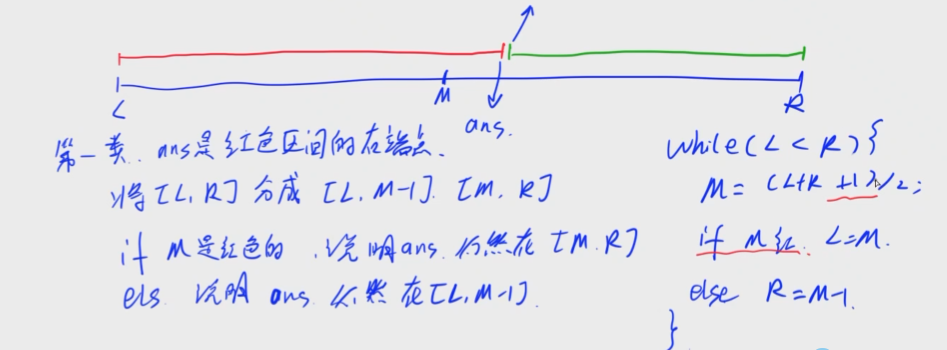
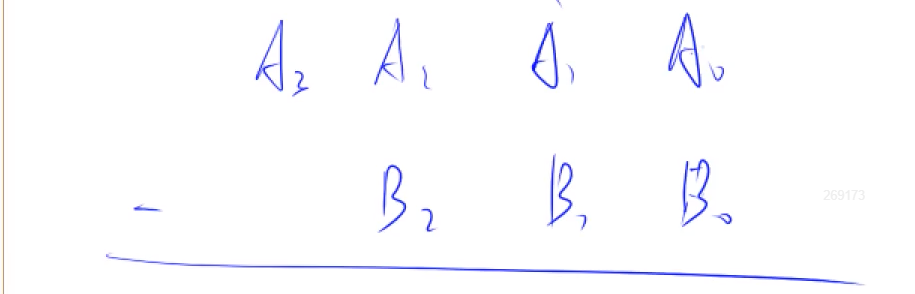
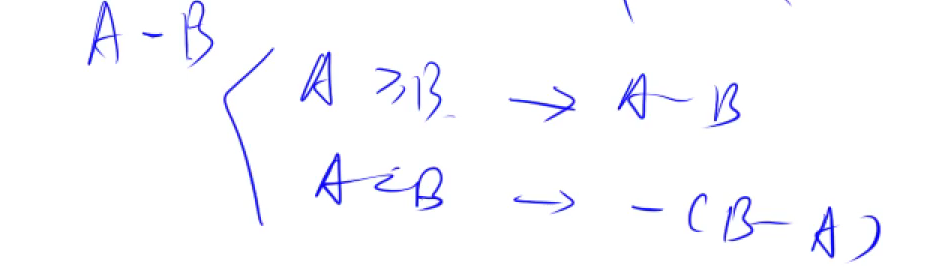
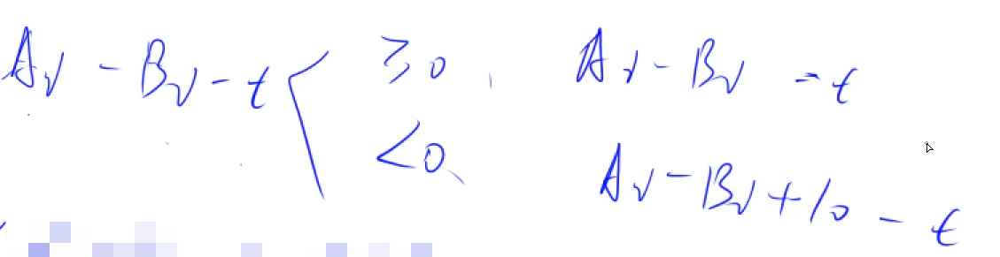
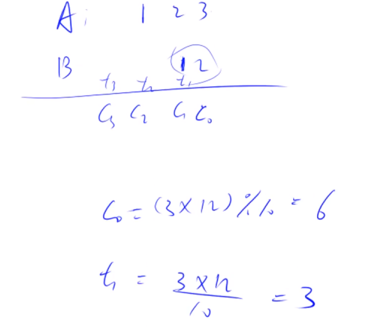
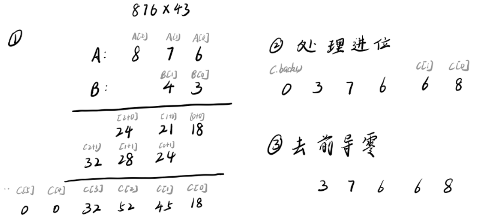

### 排序

#### 快速排序

```c++
void quick_sort(int q[], int l, int r){
    if (l >= r) return;
    // 哨兵取随机位置的元素
    int x = q[rand() % (r - l + 1) + l];
    int i = l - 1, j = r + 1;
    while (i < j){
        do i++; while (q[i] < x);
        do j--; while (q[j] > x);
        if (i < j) swap(q[i], q[j]);
    }
    quick_sort(q, l, j);
    quick_sort(q, j + 1, r);
}
```

其中11、12行可以写成`quick_sort(q, l, i - 1)`和`quick_sort(q, i, r)`,此时哨兵不能取`q[l]`,否则死循环


####  归并排序

```c++
void merge_sort(int q[], int l, int r){
    if (l >= r) return;
	// 分
    int mid = l + r >> 1;
    merge_sort(q, l, mid), merge_sort(q, mid + 1, r);
	// 归并
    int k = 0, i = l, j = mid + 1;
    while (i <= mid && j <= r){
        if (q[i] <= q[j]) tmp[k ++] = q[i ++];
        else tmp[k ++] = q[j ++];
    }
    while (i <= mid) tmp[k ++] = q[i ++];
    while (j <= r) tmp[k ++] = q[j ++];

    for(i = l, j = 0; i <= r; i++, j++) q[i] = tmp[j];
}
```


### 二分

本质是有边界
#### 整数二分

两种边界情况


-   确定一个区间，使得目标值一定在区间中

-   找到一个性质(即**判断条件**)，满足：
    -   性质具有二段性（一半全部满足某一性质，另一半不满足）
    -   答案是二段性的分界点

取端点时，注意是`L=M`还是`R=M`，如果是`L=M`则M取值需要向上取，`M=(L+R+1)>>1`


##### 第一类 左半红色区域右端点

-   ans是红色区域的右端点
-   将`[L, R]`分成`[L, M-1]`和`[M, R]`
-   

```c++
int bsearch(int l, int r){
    // 需要找红色区间右端点
    while(l < r){
        int mid = l + r + 1 >> 1;
        // 符合左半红色区域条件, ans在右端点上
        if(check(mid)) l = mid;
        else r = mid - 1;
    }
    return l;
} 
```


##### 第二类 右半绿色区域左端点

-   ans是绿色区域的左端点
-   将`[L, R]`分成`[L, M]`和`[M+1, R]`
    -   区分M点分在哪边，主要是看ans端点相对于M的位置

```c++
int bsearch(int l, int r){
    // 需要找绿色区间左端点
    while(l < r){
        int mid = l + r >> 1;
        // 符合右半绿色区域条件, ans在左端点上
        if(check(mid)) r = mid;
        else l = mid + 1;
    }
    return r;
} 
```


#### 浮点数二分

`(r - l > 1e-8)` 保留六位小数的话，精度就是`1e-8`，总数比要求再多2位即可

两种写法，一种是`while(r - l > *)` 另一种是直接迭代100次


### 高精度

#### 高精度加法

**大整数存储**类比小端存储，个位存第一个位置，最高位存数组最后一位n

依次模拟每位相加再进位

```c++
vector<int> add(vector<int> &A, vector<int> &B){
    vector<int> C;
    int t = 0;// 进位
    // 因为是倒着存的，所以个位从0位开始
    for(int i = 0; i < A.size() || i < B.size(); i++){
        if(i < A.size()) t += A[i];
        if(i < B.size()) t += B[i];
        C.emplace_back(t % 10); // 加和余数
        t = t / 10; // 进位
    }
    if(t) C.emplace_back(t); // 最高位是否有进位
    return C;
}
```

#### 高精度减法



先判断A和B的大小，因为两者输入后都从`string`字符串转换为`vector<int>`，所以先比较位数，相同的话则从高位开始比较大小



在A ≥ B的情况下：t为上一位的借位

`( ( Ai - Bi - t ) + 10 ) % 10` 可以将下面两种情况合并



cmp比较vector存储方式下的大小

```c++
// A >= B
bool cmp(vector<int> &A, vector<int>& B){
    // 先比较位数
    if (A.size() != B.size()) return A.size() > B.size();
    for(int i = A.size() - 1; i >= 0; i --){
        // 从高位开始依次比较大小
        if (A[i] != B[i]) return A[i] > B[i];
    }
    // 位数和数值全部相等
    return true;
}
```

A - B

```c++
// A - B, A的位数大等于B
vector<int> sub(vector<int>& A, vector<int>& B){
    vector<int> C;
    for(int i = 0, t = 0; i < A.size(); i ++){
        t = A[i] - t;
        if(i < B.size()) t -= B[i];
        // 判断差
        C.emplace_back((t + 10) % 10);
        // 判断借位
        if (t < 0) t = 1;
        else t = 0;
    }
    // 去除前导零, 至少保留一位
    while (C.size() > 1 && C.back() == 0) C.pop_back();
    return C;
}
```

#### 高精度乘法



A * B

将B看作一个整体，使用A的每一位对B进行乘法运算，获得模Ci和进位数Ti。

`Ci = (Ai * B + Ti) % 10`

``` c++
// 高精度 * 低精度
vector<int> mul(vector<int> A, int b){
    vector<int> C;
    int t = 0;
    // 因为在i达到最高位时，进位t可能并不为0
    for (int i = 0; i < A.size() || t; ++i) {
        if (i < A.size()) t += A[i] * b;
        C.emplace_back(t % 10);
        t /= 10;
    }
    // b可能为0，会产生前导零，此时至少保证有1位0留存
    while (C.size() > 1 && C.back() == 0) C.pop_back();

    return C;
}
```

高精度 * 高精度：



```c++
// 高精度 * 高精度
vector<int> mul(vector<int> &A, vector<int> &B) {
    vector<int> C(A.size() + B.size(), 0);
    // 两数相乘，位数不可能大于 两数位数 之和

    for (int i = 0; i < A.size(); i++)
        for (int j = 0; j < B.size(); j++)
            C[i + j] += A[i] * B[j];

    int t = 0;
    for (int i = 0; i < C.size(); i++) { 
        // i = C.size() - 1时 t 一定小于 10
        t += C[i];
        C[i] = t % 10;
        t /= 10;
    }
    while (C.size() > 1 && C.back() == 0) C.pop_back(); 
    // 必须要去前导 0，因为最高位很可能是 0
    return C;
}
```
