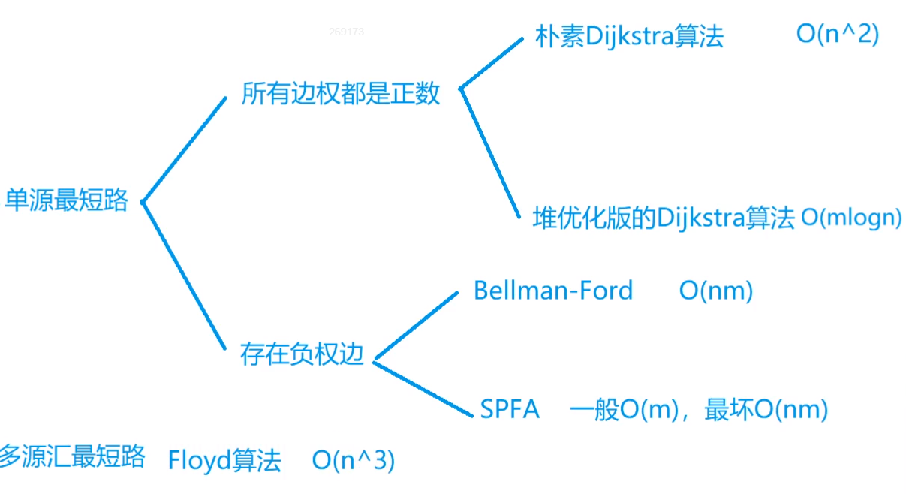

**最短路问题**



m和n^2同数量级时，稠密图，选朴素Dijkstra

m和n同数量级时，稀疏图，选堆优化版


**Dijkstra**

朴素

1.  dist[1] = 0	dist[i] = +oo
2.  for v in 1 ~ n:
    1.  t <- 不在S中的距离最短的点 	(S：当前已确定最短距离的点)	`可以优化，使用堆找最小`
    2.  S <- t
    3.  用t更新其它点的距离    `优化后总次数变为MlogN`

```c++
int n, m; //点数 边数
int g[N][N]; //存储边权值
int dist[N]; //距离
bool st[N]; //是否已经确认最小距离

int dijkstra(){
    memset(dist, 0x3f, sizeof dist);
    dist[1] = 0;
    
    for(int i = 0; i < n - 1; i++){ // 迭代n-1次
        int t = -1;
        for(int j = 1; j <= n; j++){ //找到相对t最短距离的未确定点
            if (!st[j] && (t == -1 || dist[t] > dist[j]))
                t = j;
        }
         st[t] = true; //加入S确定点集合
        
        for(int j = 1; j <= n; j++){ //更新dist
            dist[j] = min(dist[j], dist[t] + g[t][j]);
        }
    
    }
    
    if(dist[n] == 0x3f3f3f3f) return -1;
    else return dist[n];
}

int main()
{
    scanf("%d%d", &n, &m);

   memset(g, 0x3f, sizeof g); //初始化边权值
    
    while(m--){
        int a, b, c;
        scanf("%d%d%d", &a, &b, &c);
        g[a][b] = min(g[a][b], c); // 保证最小权值
    }

    printf("%d\n", dijkstra());

    return 0;
}

```


堆优化

**数组模拟邻接表**

```c++
// 例有一边A -> B
//h[A]=idx	e[idx]=B	
//ne[idx]=-1	

// h[i] 作为头结点数组，i为结点编号
// e[i] 存储idx为i的某结点指向的结点编号
// ne[i] 存储结点i的下一个结点的下标 / 表示节点i的next指针是多少
// idx 存储当前可用的结点的下标
int h[N], e[N], ne[N], idx, w[N];

//初始化
memset(h, -1, sizeof h);
// 头插法 插入一条有向边 a --> b
void add(int a, int b, int c)
{
    e[idx] = b, ne[idx] = h[a], h[a] = idx++, w[idx] = c;
    //指向结点名	  结点 尾接 头	 结点变为新的头结点
}

//遍历顶点a指向的顶点的值
for(int i = h[a]; i != -1; i = ne[i])
    cout << e[i] << ' ';
```


堆优化后的Dijsktra	`使用优先队列来替代堆`

```c++
int dijkstra(){
    memset(dist, 0x3f, sizeof dist);
    dist[1] = 0;
    
    priority_queue<PII, vector<PII>, greater<PII>> heap; //优先队列替代堆，使用小根堆
    heap.push({0, 1});
    
    while(heap.size()){
        auto t = heap.top();//取堆顶最小dist结点
        heap.pop();
        
        int ver = t.second, distance = t.first;
        if (st[ver]) continue; //已在S集合中则跳过
        st[ver] = true;
        //遍历邻接表，更新相邻结点的dist
        for(int i = h[ver]; i != -1; i = ne[i]){
            int b = e[i];
            if(dist[b] > dist[ver] + w[i]){
                dist[b] = dist[ver] + w[i];
                heap.push({dist[b], b});//更新后的结点入堆
            }
        }
    }
    if (dist[n] == 0x3f3f3f3f) return -1;
    else return dist[n];
}

int main(){
    scanf("%d%d", &n, &m);
    memset(h, -1, sizeof h); //初始化模拟邻接表   
    while(m--){//读入边
        int a, b, c;
        scanf("%d%d%d", &a, &b, &c);
        add(a, b, c);
    }
    printf("%d\n", dijkstra());
    return 0;
}
```

